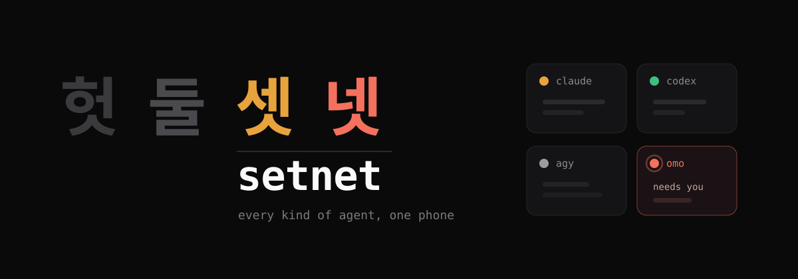
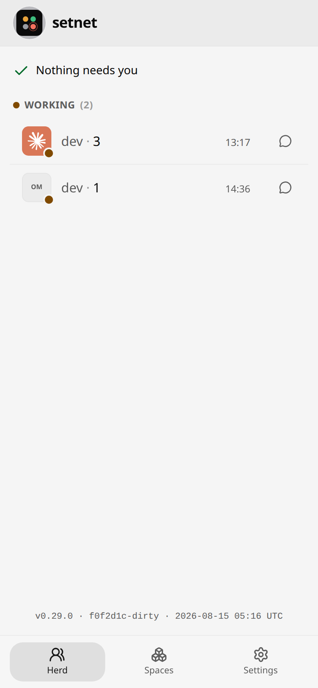
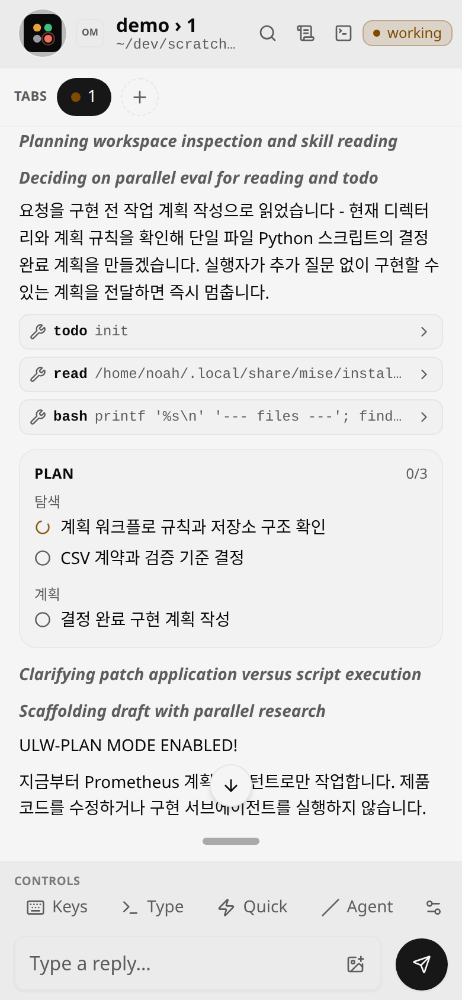
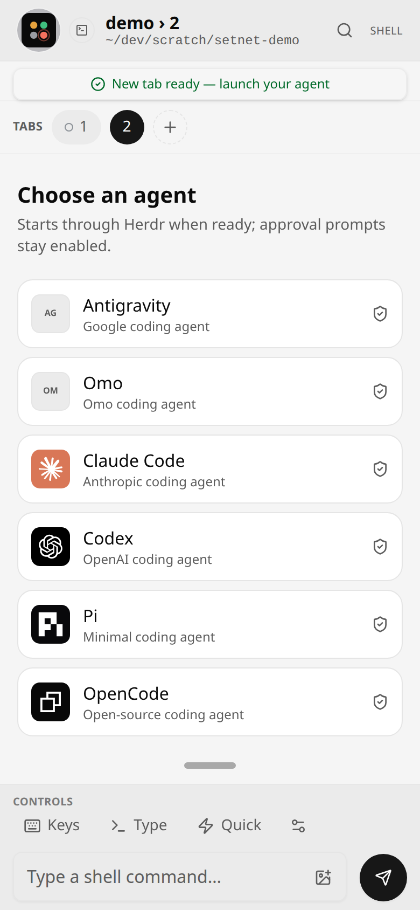

# setnet

<p align="center">
  
</p>

<p align="center">
  
  
  
  
</p>

<p align="center">
  <a href="README.md">한국어</a> · English · <a href="README.zh-CN.md">简体中文</a> · <a href="README.ja.md">日本語</a>
</p>

---

**Herd every kind of coding agent from one phone.**

setnet is a phone web UI for supervising the agent herd running on [Herdr](https://herdr.dev). It opens only inside your Tailscale tailnet — no cloud, no account.

One thing separates it from everything else: **setnet treats agents as distinct kinds.** Rather than mirroring a terminal screen and handing it to you raw, it knows what each harness can do and what it must not be asked to do — Claude Code, Codex, pi, OpenCode, and **AGY and OMO (Senpi)** as well.

## Screens

<table>
  <tr>
    <td align="center" width="33%"><br><sub><b>Herd</b> — ordered by who waits on you</sub></td>
    <td align="center" width="33%"><br><sub><b>Plan</b> — which phase OMO is actually on</sub></td>
    <td align="center" width="33%"><br><sub><b>Launcher</b> — starts each harness in auto mode</sub></td>
  </tr>
</table>

## Contents

- [Screens](#screens)
- [What's different](#whats-different)
- [Supported harnesses](#supported-harnesses)
- [Features](#features)
- [Install](#install)
- [Security — read first](#security--read-first)
- [Lineage](#lineage)
- [Documentation](#documentation)

## What's different

The closest alternative is [Collie](https://github.com/AltanS/collie) — setnet forked from it. Collie treats every agent as one universal terminal mirror. setnet adds a **harness-aware layer** on top.

| | setnet | Collie |
|---|---|---|
| **AGY · OMO (Senpi) support** | Dedicated command catalogs + transcript adapter + official logos | None |
| **Launching agents** | Create any of six agents directly from Herd or Spaces, starting each harness in auto mode except OMO | Attaches only to panes that already exist |
| **Prompt delivery path** | Herdr `agent.prompt` first; when Herdr knows only OMO's lifecycle label, a narrow fallback types only into a still-live agent pane | Only the path that types keys into the PTY |
| **Plan progress** | Parses Senpi todo-state and shows the current phase plus per-task status (pending / in progress / completed / abandoned) in the conversation | None |
| **Prompt straight from the dashboard** | Send a prompt without opening the pane, IME-safe drafts, live working-elapsed time | You have to open the pane |
| **Mobile navigation** | A dedicated tab bar (Herd / Spaces, with a needs-attention count badge) | A single dashboard |
| **Honesty about bundled commands** | Every catalog is labelled `partial` and `insert-only`, with its source stated | Presented as if the list were complete |
| **Unsupported harnesses** | Typing is refused unless you pass a two-step confirmation | Sent in one shot |
| **Reply body validation** | Malformed requests are rejected | Missing fields silently defaulted |

**The security model and deployment shapes are Collie's, untouched** — loopback bind, a single `tailscale serve` front door, the same-origin gate. There is no reason to rebuild what has already been proven.

## Supported harnesses

| Harness | Command catalog | Conversation history | Screen grammar | Launch from app |
|---|---|---|---|---|
| **AGY** (Antigravity) | ✅ as of AGY 1.1.12 | — | — | ✅ (`--dangerously-skip-permissions`) |
| **OMO** (Senpi) | ✅ as of Senpi 2026.8.12-4 | ✅ + plan progress | ✅ | ✅ |
| Claude Code | ✅ | ✅ | ✅ full grammar | ✅ (`--permission-mode auto`) |
| Codex | ✅ | ✅ | — | ✅ (`--approve-for-me`) |
| pi | ✅ | ✅ | — | ✅ (no per-tool approval gate by default) |
| OpenCode | ✅ | ✅ | — | ✅ (`--auto`) |
| omp | ✅ | — | ✅ basic | — |

"Screen grammar" means an adapter that reads choices, wizards and composer state off the terminal screen. Only Claude Code has the full grammar (prompt-select, wizard, preview, multi-select, menu); OMO shares the omp adapter. A harness with no adapter falls back to the universal mirror, and a harness with no transcript adapter (AGY, omp) never offers the history affordance.

The command catalogs are **deliberately incomplete.** Workspace skills, plugins and MCP prompts add commands at runtime, so setnet exposes only what it actually knows, marks it `partial`, and names its source. And **tapping one does not run it** — it inserts into the composer and you send it yourself. Runtime command sets drift, and an unsupported command can have side effects.

## Features

**Harness-aware control**
- Per-harness slash-command palette — type `/` in the composer for an inline menu, tap to insert
- Typing into a harness with no adapter is blocked behind a two-step confirmation
- When replying in a pane, setnet reads the screen to confirm the composer is ready, verifies the text actually landed, and only then presses the submit key — which is what stops an Enter from answering a dialog that grabbed the keyboard
- A harness with no verified terminal grammar goes through Herdr's managed lifecycle (`agent.prompt`) first. If a lifecycle hook registered OMO's name but Herdr cannot own delivery, setnet falls back only for the exact `is not an active named agent` error and only into a still-live pane; it never falls back into an exited pane

**Conversation history**
- Reads from the agent's own session log, reaching past what the terminal can scroll back to
- OMO plans render as their own block, current phase and completed count included
- The live conversation view bounds its polling, pauses when the page is hidden, and aborts requests in flight

**Mobile-first**
- A PWA that installs to your home screen
- Herd / Spaces tab bar with a badge counting the agents that need you
- Start a new agent directly from Herd or Spaces by choosing its space and harness
- Official Claude Code, Codex, pi, OpenCode, OMO and Antigravity logos across the header, herd and launcher
- The dashboard is ordered by **who is waiting on you**, not by what changed last
- Special-keys pad (`Esc`, `Ctrl+C`, arrows), send an image from the camera roll, search within output
- Web Push the moment an agent blocks

**Yours to own**
- Runs on your machine. Loopback bind, no cloud, no account
- Your front door, your choice — `tailscale serve` by default, or a reverse proxy you run

## Install

On the host — the machine your agents run on, not your phone.

```bash
herdr plugin install chano-gpt/setnet
herdr plugin action invoke start --plugin herdr.collie
```

From a local clone, for development:

```bash
git clone https://github.com/chano-gpt/setnet.git && cd setnet
herdr plugin link "$(pwd)"
herdr plugin action invoke start --plugin herdr.collie
```

> The plugin id is still `herdr.collie`. It stays that way until rebranding is confirmed not to break existing installs.

You need: [Bun](https://bun.sh), [Herdr](https://herdr.dev) 0.7.0 or newer, [Tailscale](https://tailscale.com), and git. First-run banner, updates and troubleshooting are all covered in the [operations manual](OPERATIONS.md).

## Security — read first

**setnet is remote shell access to your machine, by design.** One call types arbitrary keystrokes into a live terminal pane. Anyone who can reach the URL can read every pane — source, secrets, environment, agent output — and run any command as your user. There is no sandbox and no command allow-list, because either one would defeat the purpose. **Treat the URL like a root login.**

Agents started from the app enter a mode that automatically handles approval prompts, except OMO, which keeps its own permission flow. Antigravity uses `--dangerously-skip-permissions`; Claude, Codex and OpenCode use their harness-specific auto options. Tool calls in those sessions do not wait for approval every time.

The defenses that ship on by default:

- **Loopback bind only** (`127.0.0.1`) — never `0.0.0.0`
- **Exactly one hardened front door** — `tailscale serve` (the default), or a conforming reverse proxy
- **`COLLIE_TRUSTED_USER`** — reject every tailnet login but your own
- **`COLLIE_DEVICE_HEADER` + `COLLIE_DEVICE_ALLOWLIST`** — per-device write access; everything else is read-only
- **`COLLIE_PUBLIC_HOSTS`** — Host validation, which blocks DNS rebinding
- A same-origin gate and a strict CSP; pane output renders only as React text nodes

> 🚫 **Never `tailscale funnel` this.** Funnel exposes it to the public internet. There is no scenario in which funneling setnet is correct.

The exact configuration for the four deployment shapes — personal tailnet, device-authorizing proxy, reverse proxy alone, and an off-host identity proxy — is an area where a mistake is an incident, so it is **kept in the original English rather than translated**: read [operations manual → Security](OPERATIONS.md#%EF%B8%8F-security--read-before-you-run-it) and [Deployment variants](OPERATIONS.md#deployment-variants).

Provided as-is, no warranty.

## Lineage

setnet forked from [AltanS/collie](https://github.com/AltanS/collie) and added a cross-harness layer on top. What Collie proved first — that herding agents from a phone is genuinely usable, and how to expose it safely — is carried over intact. The full install, security and deployment documentation upstream refined is preserved verbatim in English in the [operations manual](OPERATIONS.md).

## Documentation

- Design rationale — [`ARCHITECTURE.md`](./ARCHITECTURE.md)
- Verified Herdr socket API — [`HERDR_API.md`](./HERDR_API.md)
- Ops, versioning and conventions — [`CLAUDE.md`](./CLAUDE.md)
- Decision records — [`.adr/`](./.adr/)
- Changes — [`CHANGELOG.md`](./CHANGELOG.md)
- Install, security and deployment manual — [`OPERATIONS.md`](./OPERATIONS.md)
